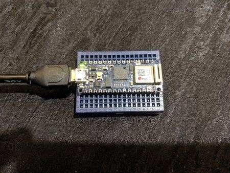
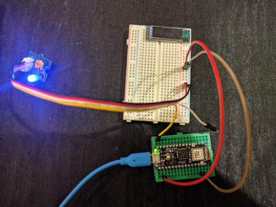

# Arduino Sensor Station

## What you need

    - Arduino or compatible microcontroller
    - Grove IoT Starter Kit parts
    - Personal computer with Go 1.12+ and TinyGo installed, and a serial port.

## Installation

### Go 1.12

Info here...

### TinyGo

Info here...

### Bossac

Info here...

## Connecting the Arduino to your computer

Plug the Arduino into your computer using a USB cable. There may be one provided in your starter kit.

## Running the code

The TinyGo programs will run directly on the Arduino's microcontoller. The procedure is basically:

- Edit your TinyGo program.
- Compile and flash it to your Arduino.
- The program executes from the Arduino. You can disconnect it from your computer and plug into a battery if you wish.

To compile and run the code:

### Linux

Info here...

### macOS


Info here...

### Windows

Info here...

## Code

### step0.go - Built-in LED



This tests that you can compile and flash your Arduino with TinyGo code, by blinking the built-in LED.

```
$ tinygo flash -t arduino ./sensor/arduino/step0/main.go
```

### step1.go - Blue LED



- Plug a blue LED to pin 3 and pin 4 on the breadboard. Make sure the longer pin of the LED is plugged into pin 3. Any column on the breadboard (a-e) will work.

- Connect pin 3 on the Arduino to pin 3 on the breadboard. Choose any color of cable besides red or black.

- Connect pin 4 on the breadboard to the breadboard's blue ground rail (-) using a black jumper cable.

- Discover what tty is being used by your connection: `ls /dev/tty.*`

Run the code.

```
$ tinygo flash -t arduino ./sensor/arduino/step1/main.go
```

You should see the blue LED blink.

### step2.go - Blue LED, Button


- Connect the button to the breadboard so one side connects to pins 7 and 9 on one side of the gap, and connects to pins 7 and 9 on the other side of the gap.

- Connect a red jumper cable from the power rail (+) on the breadboard to pin 7 on the breadboard.

- Connect a 10K Ohm resistor from pin 9 on the breadboard to pin 11 on the breadboard.

- Connect a black jumper cable from the ground rail (-) on the breadboard to pin 11 on the breadboard.

- Connect pin 2 on the Arduino to pin 9 on the breadboard on the opposite side. Choose any color of cable besides red or black.

Run the code.

```
$ tinygo flash -t arduino ./sensor/arduino/step2/main.go
```

When you press the button, the blue LED should turn on.

### step3.go - Blue LED, Button, Green LED


- Plug a green LED to pin 13 and pin 14 on the breadboard. Make sure the longer pin of the LED is plugged into pin 13.

- Connect pin 4 on the Arduino to pin 13 on the breadboard. Choose any color of cable besides red or black.

- Connect pin 14 on the breadboard to the breadboard's blue ground rail (-) using a black jumper cable.

Run the code.

```
$ tinygo flash -t arduino ./sensor/arduino/step3/main.go
```

The green LED should light up. When you press the button, the blue LED should turn on, and the green LED should turn off.

### step4.go - Blue LED, Button, Green LED, ...

...
