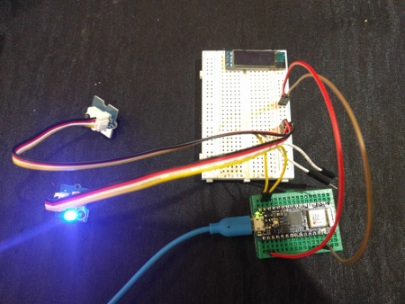
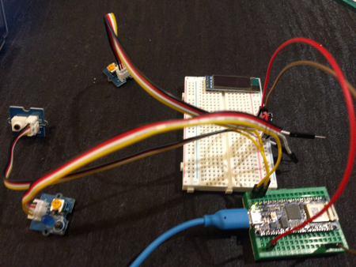
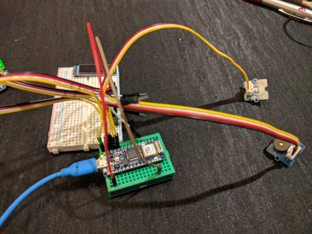
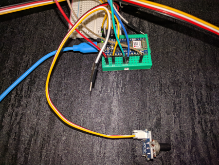
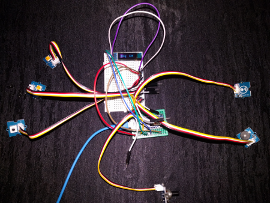

# Arduino Sensor Station

## What you need

    - Arduino Nano33 IoT board
    - Grove IoT Starter Kit parts
    - Personal computer with Go 1.12+ and TinyGo installed, and a serial port.

## Installation

### Go 1.12

If somehow you have not installed Go 1.12 on your computer already, you can download it here:

https://golang.org/dl/

### TinyGo

Follow the instructions here:

https://tinygo.org/getting-started/

### TinyGo drivers

To install the various drivers and other code dependencies run these commands:

```
go get -u tinygo.org/x/drivers
go get -u github.com/eclipse/paho.mqtt.golang
```

### Bossa

In order to "flash", meaning to move the binary code from your computer to the Arduino, you must install the "bossac" command line utility whihc is part of BOSSA.

#### Linux

On Linux, install from source:

```
git clone https://github.com/shumatech/BOSSA.git
cd BOSSA
make
```

#### macOS

On macOS, download the installer from https://github.com/shumatech/BOSSA/releases/download/1.9.1/bossa-1.9.1.dmg

One you have downloaded it, double click on the .dmg file to perform the installation.

## Connecting the Arduino to your computer


Plug the Arduino into your computer using a USB cable. There may be one provided in your starter kit.

## Running the code

The TinyGo programs will run directly on the Arduino's microcontoller. The procedure is basically:

- Edit your TinyGo program.
- Compile and flash it to your Arduino.
- The program executes from the Arduino. You can disconnect the Arduino from your computer and plug it into a battery if you wish, the program executes directly on the microcontroller.

Let's get started!

## Code

### IMPORTANT! macOS-specific required steps (Linux users can ignore)
The Linux and macOS device subsystems have subtle differences. **In order to talk to the Arduino board on a Mac**, you need to discover how macOS
system has named it. Plug it in and follow these commands:

```
ls /dev | grep usb
```

Should produce entries like (you may have different numbers after
`usbmodem`):

```
/dev/cu.usbmodem141201
/dev/tty.usbmodem141201
```

Set the fully qualified path for the `tty` entry into an environment variable. We'll use this below in the macOS version of the steps.

```sh
export NANO33_DEV_PATH=/dev/{YOUR TTY USBMODEM ID}
```


### step0.go - Built-in LED


This tests that you can compile and flash your Arduino with TinyGo code, by blinking the built-in LED.

- Click on the "RST" button two times to put the Arduino into bootloader mode so you can load your own code onto it. The LED labeled "L" should remain lit to indicate that the Arduino is ready to receive your code.

Run the following command to compile your code, and flash it onto the Arduino:

#### Linux
```
tinygo flash -target arduino-nano33 ./sensor/arduino/step0/main.go
```

#### macOS
```
tinygo flash -target arduino-nano33 -port=$NANO33_DEV_PATH ./sensor/arduino/step0/main.go
```

Once the Arduino is flashed correctly, the built-in LED labeled "L" should start to turn on and off once per second. Now everything is setup correctly and you are ready to continue.

### step1.go - Blue LED


- Connect one of the "Ground" pins on the Arduino to the breadboard's ground rail (-) using a black or brown jumper cable.

- Connect the "3.3V" pin on the Arduino to the breadboard's power rail (+) using a red jumper cable.

- Plug the Grove blue LED into the provided cable with the Grove connector on one end, and the male jumpers on the other. Make sure the LED itself is plugged into the Grove board.

- Connect the black male end of the Grove cable to the breadboard's ground rail (-).

- Connect the red male end of the Grove cable to the breadboard's power rail (+).

- Connect the yellow male end of the Grove cable to pin D12 on the Arduino.

Run the code.

#### Linux
```
tinygo flash -target arduino-nano33 ./sensor/arduino/step1/main.go
```

#### macOS
```
tinygo flash -target arduino-nano33 -port=$NANO33_DEV_PATH ./sensor/arduino/step1/main.go
```

You should see the blue LED blink.

### step2.go - Blue LED, Button



- Plug the Grove Button into a provided cable with the Grove connector on one end, and the male jumpers on the other.

- Connect the black male end of the Grove cable to the breadboard's ground rail (-).

- Connect the red male end of the Grove cable to the breadboard's power rail (+).

- Connect the yellow male end of the Grove cable to pin D11 on the Arduino.

Run the code.

#### Linux
```
tinygo flash -target arduino-nano33 ./sensor/arduino/step2/main.go
```

#### macOS
```
tinygo flash -target arduino-nano33 -port=$NANO33_DEV_PATH ./sensor/arduino/step2/main.go
```

When you press the button, the blue LED should turn on.

### step3.go - Blue LED, Button, Green LED



- Plug the Grove green LED into one of the provided cable with the Grove connector on one end, and the male jumpers on the other.

- Connect the black male end of the Grove cable to the breadboard's top left set of pins (-).

- Connect the red male end of the Grove cable to the breadboard's top right (+) set of pins.

- Connect the yellow male end of the Grove cable to pin D10 on the Arduino.

Run the code.

#### Linux
```
tinygo flash -target arduino-nano33 ./sensor/arduino/step3/main.go
```

#### macOS
```
tinygo flash -target arduino-nano33 -port=$NANO33_DEV_PATH ./sensor/arduino/step3/main.go
```

The green LED should light up. When you press the button, the blue LED should turn on, and the green LED should turn off. When you release the button, the blue LED should turn off, and the green LED should turn on again.

### step4.go - Blue LED, Button, Green LED, Buzzer, Touch



- Plug the Grove touch sensor into one of the provided cables with the Grove connector on one end, and the male jumpers on the other.

- Connect the black male end of the Grove cable to the breadboard's top left set of pins (-).

- Connect the red male end of the Grove cable to the breadboard's top right (+) set of pins.

- Connect the yellow male end of the Grove cable to pin D9 on the Arduino.

- Plug the Grove speaker into one of the provided cables with the Grove connector on one end, and the male jumpers on the other.

- Connect the black male end of the Grove cable to the breadboard's top left set of pins (-).

- Connect the red male end of the Grove cable to the breadboard's top right (+) set of pins.

- Connect the yellow male end of the Grove cable to pin D8 on the Arduino.

Run the code.

#### Linux
```
tinygo flash -target arduino-nano33 ./sensor/arduino/step4/main.go
```

#### macOS
```
tinygo flash -target arduino-nano33 -port=$NANO33_DEV_PATH ./sensor/arduino/step4/main.go
```

### step5.go - Blue LED, Button, Green LED, Buzzer, Touch, Dial



- Plug the Grove dial into one of the provided cables with the Grove connector on one end, and the male jumpers on the other.

- Connect the black male end of the Grove cable to the breadboard's top left set of pins (-).

- Connect the red male end of the Grove cable to the breadboard's top right (+) set of pins.

- Connect the yellow male end of the Grove cable to pin A0 on the Arduino.

#### Linux
```
tinygo flash -target arduino-nano33 ./sensor/arduino/step5/main.go
```

#### macOS
```
tinygo flash -target arduino-nano33 -port=$NANO33_DEV_PATH ./sensor/arduino/step5/main.go
```

### step6.go - Blue LED, Button, Green LED, Buzzer, Touch, Dial, OLED



- Connect a jumper wire from the "GND" pin on the breadboard next to the OLED display, to the breadboard's top left set of pins (-).

- Connect a jumper wire from the "VCC" pin on the breadboard next to the OLED display, to the breadboard's top right (+) set of pins.

- Connect a jumper wire from the "SCL" pin on the breadboard next to the OLED display, to the Arduino Nano33's A5 pin.

- Connect a jumper wire from the "SDA" pin on the breadboard next to the OLED display, to the Arduino Nano33's A4 pin.

#### Linux
```
tinygo flash -target arduino-nano33 ./sensor/arduino/step6/main.go
```

#### macOS
```
tinygo flash -target arduino-nano33 -port=$NANO33_DEV_PATH ./sensor/arduino/step6/main.go
```

### step7.go - Blue LED, Button, Green LED, Buzzer, Touch, Dial, OLED, MQTT


Still in progress...
